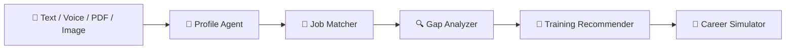

<div align="center">

# 🎯 Skill-Gap-to-Job Matching Agent

**Tell it who you are. It tells you which jobs fit, what's missing, and exactly what to learn next.**


</div>

---

## ✨ What It Does

Most job seekers know they want a job, but not **why they aren't getting shortlisted** or **what to learn to fix it**. This agent answers both.

Give it your profile in any form: **type it, speak it, upload a PDF, or snap a photo of your resume**. In seconds you get:

- 💼 The **top 10 jobs** that fit you, scored from 0 to 100
- 🔍 A **skill-by-skill gap report** for every job
- 🚀 An **ROI-ranked training roadmap** with real courses (NPTEL, Coursera, Skill India)
- 🧪 A **career simulator** that shows how many jobs you unlock if you learn a skill, before you spend a single hour

---

## 🧠 How It Works



| Agent | What it does |
|---|---|
| 👤 **Profile Agent** | Gemini reads your input and pulls out name, education, skills, experience, location and interests. Skills are normalized (`JS` becomes `JavaScript`, `K8s` becomes `Kubernetes`). |
| 💼 **Job Matcher** | Sentence-Transformers embeddings compare your skills to each job. Score = **80% required + 20% nice-to-have skills**. |
| 🔍 **Gap Analyzer** | Sorts every skill into **Matched**, **Partial** or **Missing**, then Gemini writes a short, fact-only explanation. |
| 🚀 **Recommender** | Finds courses that close your gaps and ranks them by jobs unlocked, score gain and duration. |
| 🧪 **Simulator** | Try "what if I learn X?" and see before-vs-after matches, cost, weeks needed and newly unlocked jobs. |

---

## 🌟 Highlights

- 🖼️ **Multimodal input**: free text, voice, PDF/TXT and scanned resume images
- 🌐 **Live jobs**: `refresh_jobs.py` pulls real postings from Adzuna (India) and Gemini extracts the skills from each one
- 🔮 **4 / 8 / 12 week outlook**: see how your matches improve as you keep learning
- 🧭 **Best path finder**: the best skills to learn within your time and budget
- 🛡️ **Resilient by design**: Gemini calls retry automatically and fall back to backup models when a model is overloaded
- ⚡ **Works offline for text**: no Gemini key? Text input still works with built-in keyword extraction
- 🎬 **One-click demo profiles**: Backend Engineer, Data Analyst, Embedded / IoT, UI/UX Designer

---

## 📁 Project Structure

```
skillGapChatbot/
├── app/
│   ├── config.py            # Thresholds, model names, constants
│   ├── llm.py               # Gemini calls with retry and fallback
│   ├── profile_agent.py     # Profile parsing and skill normalization
│   ├── matcher.py           # Embedding-based job matching
│   ├── gap_agent.py         # Gap analysis and explanations
│   ├── recommender.py       # Course matching and ROI ranking
│   ├── simulator.py         # Scenario simulation and best path search
│   ├── simulator_ui.py      # Simulator interface
│   ├── live_jobs.py         # Adzuna fetching and skill extraction
│   └── graph.py             # LangGraph pipeline
├── data/
│   ├── jobs.json            # Job postings
│   ├── courses.json         # NPTEL, Coursera, Skill India courses
│   ├── skills_taxonomy.json # Synonym mappings
│   └── skills_vocab.json    # Skill vocabulary
├── tests/
│   ├── test_profiles.json   # Benchmark profiles
│   ├── evaluate.py          # Accuracy and coverage checks
│   └── test_pipeline.py     # End-to-end test
├── main.py                  # Streamlit app
├── refresh_jobs.py          # Refresh jobs from Adzuna
├── requirements.txt
└── .env.example
```

---

## 🚀 Quick Start

**1. Create and activate a virtual environment**
```bash
python -m venv .venv
# Windows PowerShell
.venv\Scripts\Activate.ps1
# Linux / macOS
source .venv/bin/activate
```

**2. Install dependencies**
```bash
pip install -r requirements.txt
```

**3. Add your API keys**
```bash
cp .env.example .env
```
```env
GEMINI_API_KEY=your_gemini_api_key_here
ADZUNA_APP_ID=your_adzuna_app_id_here
ADZUNA_APP_KEY=your_adzuna_app_key_here
```

> 🔒 Never commit `.env`. It is already in `.gitignore`.
> `GEMINI_API_KEY` powers voice, image and LLM explanations. The Adzuna keys are only needed to refresh jobs.

**4. Run the app**
```bash
streamlit run main.py
```
Open **http://localhost:8501** and click a demo profile to try it.

---

## 🔄 Refresh Job Data

```bash
python refresh_jobs.py
```
Fetches current postings, extracts skills with Gemini and saves them to `data/jobs.json`. The old file is backed up first. Restart the app afterwards.

---

## ✅ Tests

```bash
python tests/evaluate.py       # matching accuracy and course coverage
python tests/test_pipeline.py  # full pipeline end to end
```

---

## 🛠️ Troubleshooting

| Problem | Fix |
|---|---|
| `503 UNAVAILABLE: high demand` on image or voice scan | Gemini is overloaded. The app retries and switches to backup models on its own. If it still fails, wait a few minutes or use the **Free Text** or **Document** tab. |
| Blank profile after an image scan | The image couldn't be read. Try a clearer image or paste the text under **Free Text**. |
| Backup models fail | Edit `GEMINI_FALLBACK_MODELS` in `app/config.py`. |
